# Smart Grocery Management System (Java Swing)

A full-featured desktop-based Grocery Store Management System built using **Java Swing** and **Object-Oriented Programming** principles. The system simulates real-world retail operations including inventory control, billing (POS), customer management, reporting, and notifications.

---

## ✨ Features

### 📦 Inventory Management
- Add, update, and delete products
- Support for perishable and non-perishable items
- Real-time stock tracking
- Low-stock and expiry alerts
- Automatic data persistence using file handling

### 💳 Point of Sale (POS)
- Cashier checkout system
- Automatic price calculation
- Sales transaction recording
- Inventory update after each sale
- Multi-cashier support

### 👥 Customer Management
- Customer registration and login
- Role-based access control (Admin / Cashier / Customer)
- Order history tracking with timestamps
- Loyalty points system

### 📊 Reports & Analytics
- Top-selling products report
- Sales summary reports
- Inventory statistics overview
- Business performance tracking

### 🔔 Notification System
- Low stock alerts
- Expiry warnings
- Real-time GUI notifications

---

## 🧠 System Architecture

The project follows clean Object-Oriented Design principles:

- MVC (Model–View–Controller) architecture
- Separation of business logic and UI
- Modular package structure
- Reusable components and managers
- File-based data persistence

---

## 🛠️ Tech Stack

- Java (JDK 11+)
- Java Swing (GUI Development)
- Object-Oriented Programming (OOP)
- File I/O (Data Storage)
- LocalDate API

---

## 📂 Project Structure

```
src/
├── main/      # Application entry point (App.java)
├── model/     # Entity classes (Product, Customer, Order, etc.)
├── manager/   # Business logic layer
├── view/      # GUI (Swing UI screens)
└── listener/  # Event listeners
```

---

## 🚀 How to Run

### 1. Clone Repository
```
git clone https://github.com/Sidra-Hayat/smart-grocery-management-system-java.git
cd smart-grocery-management-system-java
```

### 2. Open in IDE
- IntelliJ IDEA / Eclipse / NetBeans
- Configure JDK 11+

### 3. Run Application
Run `src/main/App.java` from your IDE (this is the application entry point).

---

## 👤 Default Login Credentials

| Role     | Username | Password |
|----------|----------|----------|
| Admin    | lara     | lara123  |
| Customer | rija     | rija123  |
| Cashier  | ali      | ali123   |

---

## 📸 Screenshots

### Login
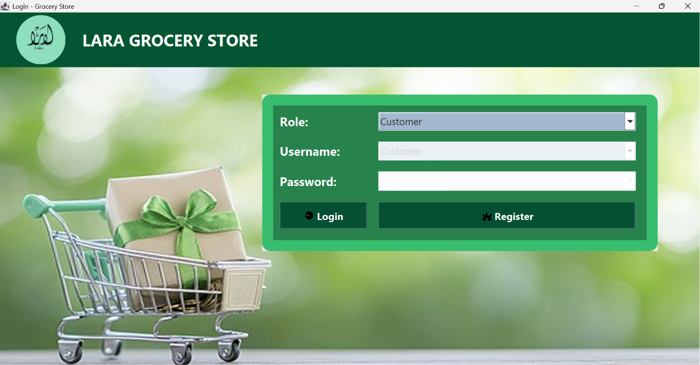

### Admin Dashboard
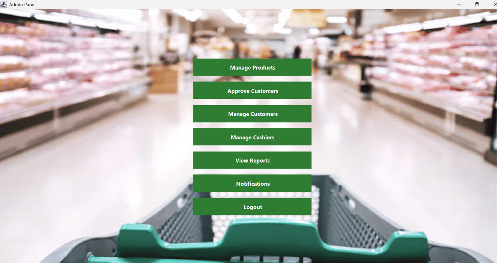

### Customer Dashboard
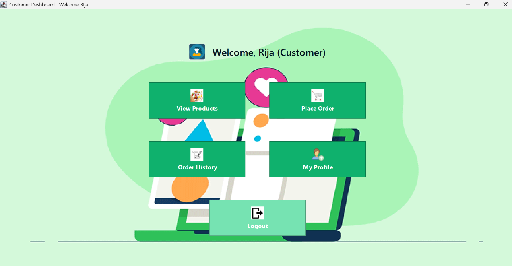

### Customer Profile
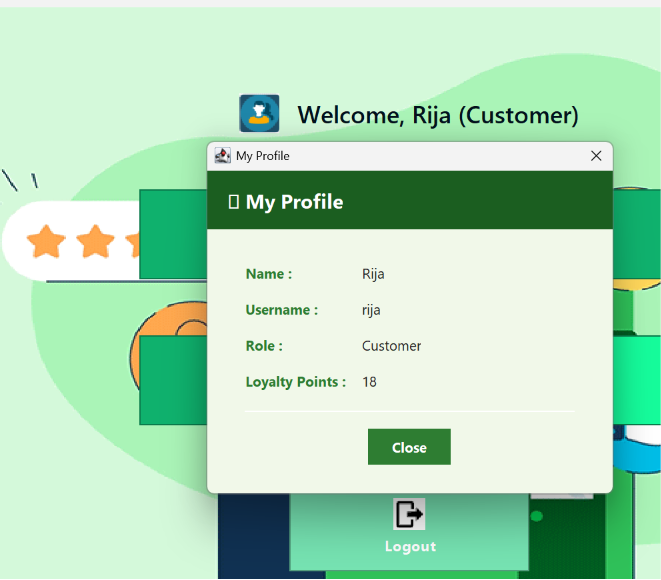

### Customer Registration
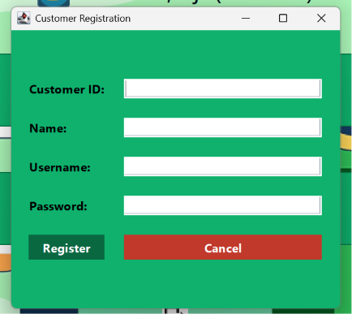

### Cashier Dashboard
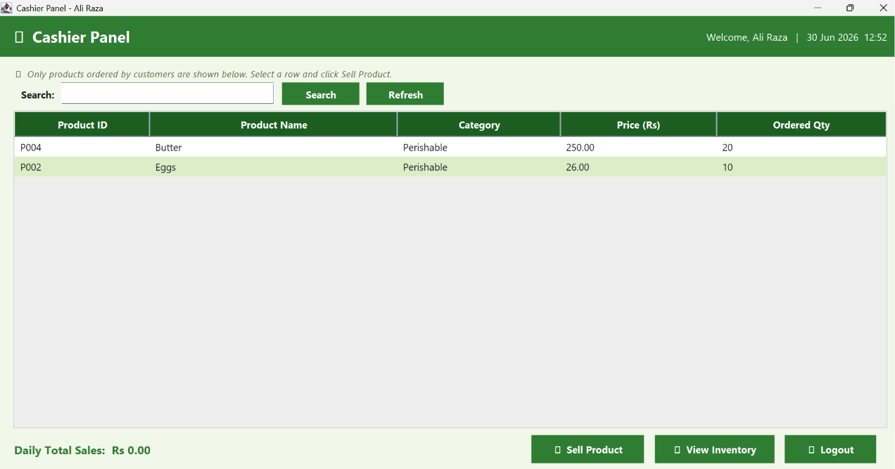

### Manage Customers
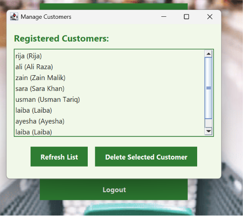

### Approve Customers
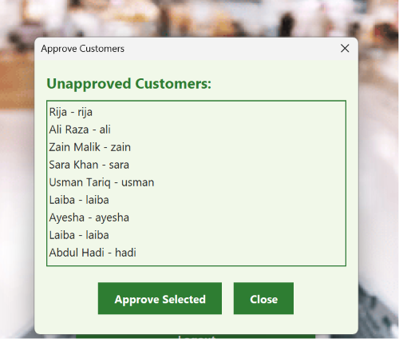

### Manage Cashiers
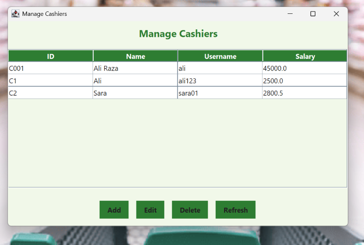

### Add Product
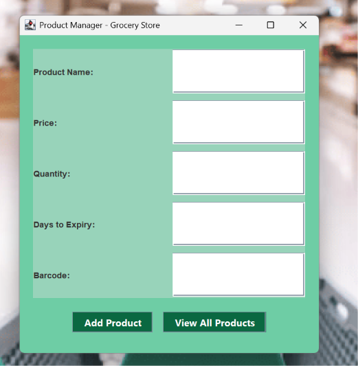

### View Products (Customer View)
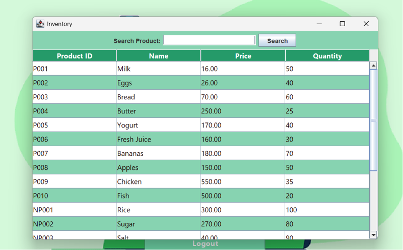

### Top Selling Report
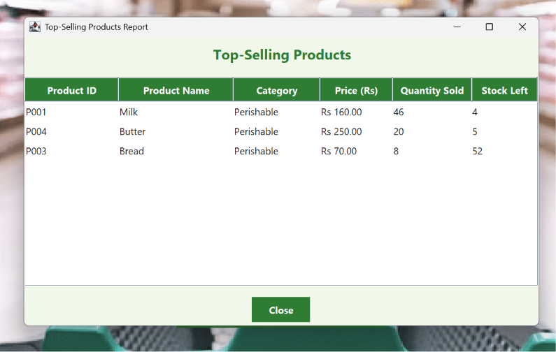

### Urgent Notifications
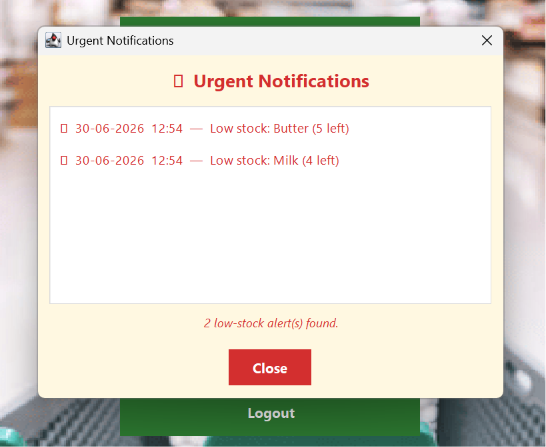

### place order 
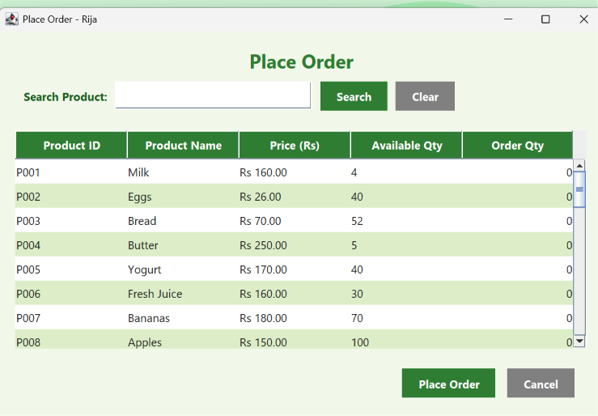
###  order History
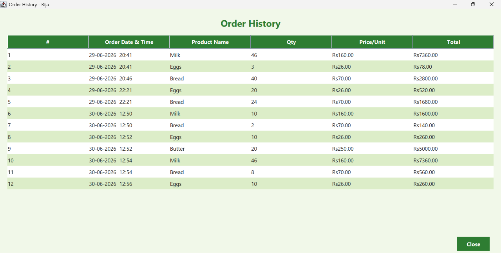
---

## 📌 Limitations

- File-based storage (no database integration yet)
- GUI design can be further improved
- No automated unit testing implemented
- Hardcoded demo configuration data

---

## 🔮 Future Improvements

- Database integration (MySQL / PostgreSQL)
- Web-based version using Spring Boot
- AI-based product recommendations
- PDF invoice generation
- Multi-store support system

---

## 👨‍💻 Author

**Sidra Hayat**
GitHub: [@Sidra-Hayat](https://github.com/Sidra-Hayat)

---

## ⭐ Project Highlights

- Real-world grocery store simulation
- Complete POS (billing) system
- Role-based authentication system
- Inventory + reporting system
- Clean OOP + MVC architecture